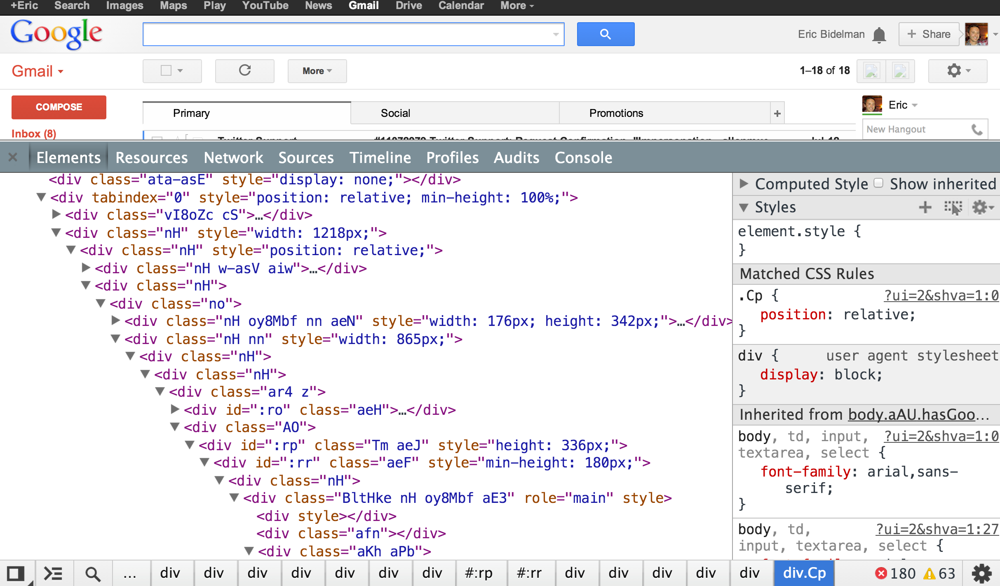

Web Components
==============

2013年Google I/Odah大会上，Google发布了一个新的Web UI框架——Polymer，由加盟Google的原Palm webOS开发团队打造，是一套以“一切皆组件、最少化代码量、最少框架限制”为设计理念的Web UI框架。Web Components则提供了一种更彻底的解耦方式，更加方便了UI的开发和模块化，可以说是Polymer的基础之一。

现在已经步入2015年，回首过去的2014年，我们可以看到，包括Android 5.0的Material Design设计理念，其实质与polymer的思想如出一辙，可以预见的是，以后肯定会有越来越多的人重视和使用。

### Preface
让我们先了解一下传说中的Polymer，Polymer由以下几层组成：
* 基础层（Foundation）——platform.js：基本构建块，其中大部分API最终将成为原生浏览器API。
* 核心层（Core）——polymer.js：基础层实现的辅助工具。
* 元素层（Elements）：包括构建于核心层之上的UI以及非UI组件。

其中核心层和元素层与本文主要内容无关，这里撇去不谈，而最低层的基础层（platform.js）则是这次的重点。
其中，基础层使用了以下技术：
* DOM Mutation Oberservers和 Object.observe()：用于监视DOM元素
* JavaScript对象的改变：该功能可能会在ECMAScript 7中正式标准化
* Pointer Events ：在所有的平台上以同样的方式处理鼠标和触摸操作
* Shadow DOM：将结构和样式封装在元素内（比如定制元素）
* Custom Elements：定义自己的HTML5元素。自定义元素的名字中必须包括一个破折号，它的作用类似于命名空间，为了将其与标准元素区分开来
* HTML Imports：封装自定义元素，包中包括HTML、CSS、JavaScript元素
* Model-Driven Views（MDV）：直接在HTML中实现数据绑定
* Web Animations：统一Web动画实现API。

可以看到，以上特性基本上目前Chrome浏览器已经支持，数据双向绑定则在ES6中得到支持，现在只有Chrome开发版兼容。
其中，以上第3-5个API都是Web Components的一部分。很明显，Web Components对Polymer的重要性非同一般。

### Web Components
下面就来说说Web Components。
Web Components(组件)是一系列前沿规范，它：
* 使得构建部件(widget)成为可能
* 重用更为可靠
* 即便后续版本的组件修改了内部实现细节也不会使页面出错。

这是否意味着你得决定什么时候用 HTML/JavaScript，什么时候用 Web 组件？不！HTML 和 JavaScript 可以制作交互式可视化内容， 部件也是交互式可视化内容。在开发部件的过程中自然而然的就会利用你的 HTML 和 JavaScript 技巧。Web 组件标准就是以此为目的而设计的。

Web 组件由四部分组成：
* Imports
* Templates
* Shadow DOM
* Custom Elements
* Packaging

### Import
先从导入入手，思考一个问题：为什么需要导入？

先想想你在 web 上是如何加载不同类型的资源。对于 JS，我们有` <script src=""`，`<link rel="stylesheet" href="">` 应该是 CSS 的首选，图片可以用 ``，视频则有 `<video>`，音频`<audio>`…… 你明白我在说什么了吧！ web 上绝大部分的内容都有简单明了的加载方式。可对于 HTML 呢？下面是可选的几种方案：
* `<iframe>` - 可用但笨重。iframe 中的内容全部存在于一个不同于当前页的独立上下文中。这是个很棒的特性，但也为开发者们带来了额外的挑战 (将 frame 按照内容尺寸来缩放已经有点难度，在 iframe 和当前页面之间写点 JS 能把人绕晕，更别提操作样式了)。
* `AJAX` - 我喜欢 xhr.responseType="document"，可是加载 HTML 要用 JS？ 这就不大对劲了。
* `CrazyHacks™` - 用字符串的方式嵌入页面，像注释一样隐藏 (例如`<script type="text/html">`)。呕!

可笑不？ 作为 web 上最基础的内容，HTML，竟然需要这么麻烦才能得到我们想要的结果。幸运的是，Web Components 总算找到了一条正确的路。

HTML import，Web Components 阵容中的一员，是在其他 HTML 文档中包含 HTML 文档的一种方法。当然并非仅限于此，你还可以包含 CSS，JavaScript，或 .html 文件中能包含的任何内容。换句话说，这使得导入成为了加载相关 HTML/CSS/JS 的前端装x神器。

先特性检测与支持：
```javascript
function supportsImports() {
  return 'import' in document.createElement('link');
}

if (supportsImports()) {
  // 支持导入!
} else {
  // 使用其他的库来加载文件。
}
```
然后HTML import的使用确实相当的简单，看下面：
```html
index.html
<!---
	导入页面为import.html
	其他域内的资源必须允许CORS 
--->
<link rel="import" href="import.html">

import.html
<!---
	可以使用导入将 HTML/CSS/JS (甚至其他 HTML 导入) 打包成一个单独的可传递文件。
--->
<link rel="stylesheet" href="bootstrap.css">
<link rel="stylesheet" href="fonts.css">
<script src="jquery.js"></script>
<script src="bootstrap.js"></script>
<script src="bootstrap-tooltip.js"></script>
<script src="bootstrap-dropdown.js"></script>
...
```
若想访问导入的内容，需要使用 link 元素的 import 属性：
```javascript
var content = document.querySelector('link[rel="import"]').import;
```
另外值得注意的是，在导入中使用脚本，导入的内容并不在主文档中。它们仅仅作为主文档的附属而存在。即便如此，导入的内容还是能够在主页面中生效。导入能够访问它自己的 DOM 或/和包含它的页面中的 DOM：
```html
...
<script>
	// importDocument 是导入文档的引用
	var importDocument = document.currentScript.ownerDocument;
	// mainDocument 是主文档(包含导入的页面)的引用
	var mainDocument = document;
</script>
```
最后提下导入中几个 JavaScript 的规则：
* 导入中定义的函数最终会出现在 window 上。
* 你不用将导入文档中的 `<script>` 块附加到主页面。再重申一遍，脚本会自动执行。
* 导入不会阻塞主页面的解析。不过，导入文档中的脚本会按照顺序执行。它们对于主页面来说就像拥有了延迟(defer)执行的行为。

Import这里就讲这么多了，更详细的请看最下面给的链接。

### Templates
在 web 开发领域中，模板这个概念并不新鲜。实际上，服务端的 模板语言/引擎，比如 Django (Python)，ERB/Haml (Ruby)，和 Smarty (PHP) 早已应用多时。

WhatWG HTML 模板规范定义了一个新的 <template> 元素，用于描述一个标准的以 DOM 为基础的方案来实现客户端模板。该模板允许你定义一段可以被转为 HTML 的标记，在页面加载时不生效，但可以在后续进行动态实例化。引用 Rafael Weinstein(规范作者)的话：

	它们是用来放置一大团 HTML 的地方，就是那些你不想让浏览器弄乱的标记...不管它是出于什么理由。

首先还是特性检测：
```javascript
function supportsTemplate() {
  return 'content' in document.createElement('template');
}

if (supportsTemplate()) {
  // 支持！
} else {
  // 使用旧的模板技术或库。
}
```
HTML`<template> `元素代表标记中的一个模板。它包含"模板内容"；本质上是一大块的惰性可复制 DOM。
```html
<template>
	<style>
		div{
			border: solid 1px #232323;
		}
		...
	</style>
	
	<div class="comment"></div>
	...
	<script>
		...
	</script>
</template>
```
对于`<template>`，我们要知道几个重要属性：
* 它的内容在激活之前一直处于惰性状态。本质上，这些标记就是隐藏的 DOM，它们不会被渲染。
* 处于模板中的内容不会有副作用。脚本不会运行，图片不会加载，音频不会播放，直到模板被使用。
* 内容不在文档中。在主页面使用 document.getElementById() 或 querySelector() 不会返回模板的子节点。
* 模板能够被放置在任何位置，包括`<head>`，`<body>`，或 `<frameset>`，并且任何能够出现在以上元素中的内容都可以放到模板中。 注意，"任何位置"意味着 `<template>` 能够安全的出现在 HTML 解析器不允许出现的位置。

**激活一个模板**<br>
要使用模板，你得先激活它，否则它的内容将永远无法渲染。 激活模板最简单的方法就是使用 document.importNode() 对模板的 .content 进行深拷贝。 .content 为只读属性，关联一个包含模板内容的 DocumentFragment。
```js
var t = document.querySelector('#mytemplate');
// 在运行时填充 src。
t.content.querySelector('img').src = 'logo.png';

var clone = document.importNode(t.content, true);
document.body.appendChild(clone);
```
其他更多神奇的地方就有待你们去挖掘啦，篇幅有限，字长不说。

### Shadow DOM
问题总是一环扣一环，现在有个根本问题，通过上面import和template，导致 HTML 和 JavaScript 构建出来的部件难以使用：部件中的 DOM 树并没有封装起来。封装的缺乏意味着文档中的样式表会无意中影响部件中的某些部分；JavaScript 可能在无意中修改部件中的某些部分；你书写的 ID 也可能会把部件内部的 ID 覆盖。

缺乏封装的一个明显缺点在于：如果你更新了库或者部件的 DOM 更改了内部细节，你的样式和脚本就可能在不经意间遭到破坏。

于是 Shadow DOM 的出现就是为了解决 DOM 树的封装问题。Web 组件的四部分被设计成配合工作，但你也可以选择 Web 组件中的某个部分来使用。

有了 Shadow DOM，元素就可以和一个新类型的节点关联。这个新类型的节点称为 shadow root。与一个 shadow root 关联的元素称作一个 shadow host。shadow host 的内容不会渲染，shadow root 的内容会渲染。
```html
<button>Hello, world!</button>
<script>
var host = document.querySelector('button');
var root = host.createShadowRoot();
root.textContent = 'Halo, world!';
</script>
```
这是你会看到，按钮上的文字不是`Hello, world!`而是`Halo, world!`。

下面再来看如何用Shadow DOM来将内容从展现中分离出来。

**1.隐藏展现细节**<br>
假设我们要构建一个姓名卡，展示一下内容：
* 这是一个姓名卡
* 你的名称

首先，我们先按照最接近我们关心的语义的方式来书写标记：
```html
<div id="nameTag">Bob</div>
```

**2.从展现中分离内容**<br>
接下来我们把所有和展现相关的样式和 div 都放入一个 `<template>` 元素内：
```html
<template id="nameTagTemplate">
<style>
.outer {
  border: 2px solid brown;
  ...
}
...
</style>
<div class="outer">
  <div class="boilerplate">
    Hi! My name is
  </div>
  <div class="name">
    <content></content>
  </div>
</div>
</template>
```
其中里面的` <content> `元素为部件的展现创建了一个插入点(insertion point)，而该插入点将挑选 shadow host 里的内容显示到该点所在的位置上。当姓名卡渲染后，shadow host 的内容便投射(projected)到` <content> `元素出现的地方。

**3.填充内容**<br>
接下来我们就会通过脚本来填充 shadow root：
```html
<script>
var shadow = document.querySelector('#nameTag').createShadowRoot();
var template = document.querySelector('#nameTagTemplate');
var clone = document.importNode(template.content, true);
shadow.appendChild(clone);
</script>
```
通过使用 Shadow DOM，我们可以将展现细节隐藏在姓名卡中。展现细节被封装在了 Shadow DOM 中。

至此，我们实现了分离内容和展现的目的。内容在文档内，展现在 Shadow DOM 里。当需要更新的时候，浏览器会自动保持它们的同步。

当然，Shadow DOM 的强大不仅仅于此，篇幅有限，字长不说。

### Custom Elements
有了Shadow DOM，我们封装了DOM，可是有着强迫症的你依然发现有地方不爽。没错，上面的姓名卡我们用的还是`<div>`标签，仅仅通过类名来加以区别，这一点都不酷，一点都不语义化！

现在的 web 严重缺乏表达能力，你只要瞧一眼“现代”的 web 应用，比如说GMail：



堆砌` <div> `一点都不现代，是不是吓尿了。

于是乎，自定义元素必须该来了，它允许开发者定义新的 HTML 元素类型。该规范只是 Web 组件模块提供的众多新 API 中的一个，但它也很可能是最重要的一个。没有自定义元素带来的以下特性，Web 组件都不会存在：
* 定义新的 HTML/DOM 元素
* 基于其他元素创建扩展元素
* 给一个标签绑定一组自定义功能
* 扩展已有 DOM 元素的 API

下面就来手把手教你如何注册新元素

还是原来的姓名卡，这次我们定义自己的标签：
```html
<name-card>Urinx</name-card>
```
这里要特别注意的是，标签名必须包括一个连字符（-）。因此，诸如` <x-tags>、<my-element>` 和` <my-awesome-app> `都是合法的标签名，而` <tabs> `和` <foo_bar> `则不是。这个限定使解析器能很容易地区分自定义元素和 HTML 规范定义的元素，同时确保了 HTML 增加新标签时的向前兼容。

然后就是注册这个新元素：
```javascript
var nameCard = document.registerElement('name-card', {
  prototype: Object.create(HTMLElement.prototype)
});
```
第二个参数是一个（可选的）对象，用于描述该元素的 prototype。在这里可以为元素添加自定义功能（例如：公开属性和方法）。自定义元素默认继承自 HTMLElement。

目前，这个新元素已经注册了，可是什么属性和方法都没有（除继承HTMLElement的之外）。所以，我们接下来应该添加自定义的属性。

县看看元素的生命周期回调方法：
* createdCallback：	创建元素实例
* attachedCallback：向文档插入实例
* detachedCallback：从文档中移除实例
* attributeChangedCallback(attrName, oldVal, newVal)：添加，移除，或修改一个属性

比如说我们想把之前用Shadow DOM封装的HTML，CSS渲染到自定义标签上，我们可以写元素创建时的回调方法，如下：
```javascript
var proto = Object.create(HTMLElement.prototype);

proto.createdCallback = function() {...};
proto.attachedCallback = function() {...};

var XFoo = document.registerElement('x-foo', {prototype: proto});
```
在`createdCallback`方法中我们可以来创建Shadow DOM，渲染模板。总之，这货超牛逼，但篇幅有限，字长不说。

### Demo
下面就是用一个Demo来向你展现一下如何利用Web Components来进行组件开发的。看完后，你会不由惊叹，卧槽，就是这么任性！


这个Demo做的是一个炫酷的小清新风格的个人名片，分为两部分：

index.html页面：
```html
<title>Web Components Demo</title>
<style type="text/css">
@import url(http://fonts.googleapis.com/css?family=Open+Sans:300);
body{
	margin: 0;
	padding: 0;
	width: 100%;
	height: 100%;
	background: url(./bg.webp) no-repeat center center fixed;
	background-size: cover;
	display: flex-box;
}
</style>

<!-- 
	This is my Web Components
-->
<link rel="import" href="personal_card.html">

<personal-card headPhoto="./wechat.webp">
	<span class="name">Urinx</span>
	<span class="description">Front-end developer, love coding guy, not a father</span>
	<span class="location">Wuhan China</span>
</personal-card>
```
抛去样式头部不看，重点的是下面的部分。通过`link[rel='import']`引入要用到的组件：
```html
<link rel="import" href="personal_card.html">
```
然后实例化组件：
```html
<personal-card headPhoto="./wechat.webp">
	<span class="name">Urinx</span>
	<span class="description">Front-end developer, love coding guy, not a father</span>
	<span class="location">Wuhan China</span>
</personal-card>
```
很简单对不，重头全在自己写的组件上，来看personal_card.html：
```html
<template>
<style type="text/css">
@import url(http://fonts.googleapis.com/css?family=Open+Sans:300);
*{
	margin: 0;
	padding: 0;
}
.card {
	display: block;
	font-family: 'Open Sans', sans-serif;
	width: 320px;
	height: 550px;
	background-color: rgba(255, 255, 255, 0.6);
	border-radius: 10px;
	margin: auto;
	box-shadow: 0 0 5px 3px rgba(0, 0, 0, 0.1), 2px 2px 8px rgba(0, 0, 0, 0.1);
}
.card .card-header {
	height: 320px;
	border-top-left-radius: 10px;
	border-top-right-radius: 10px;
	overflow: hidden;
}
.card .card-header img{
	width: 100%;
	height: 100%;
}
.card .card-body {
	position: relative;
}
.card .card-body img {
	height: 100px;
	width: 100px;
	border-radius: 10px;
	border: 3px solid rgba(255, 255, 255, 0.6);
	position: absolute;
	top: -50px;
	left: 50%;
	margin-left: -50px;
	box-shadow: 0 6px 6px -4px rgba(0, 0, 0, 0.2);
}
.card .card-body .name {
	font-size: 32px;
	text-align: center;
	padding-top: 60px;
	margin-bottom: 10px;
}
.card .card-body .description {
	padding: 0 25px;
	line-height: 1.5;
	text-align: center;
	margin-bottom: 25px;
}
.card .card-body .location {
	font-size: 12px;
	letter-spacing: 2px;
	text-transform: uppercase;
	text-align: center;
}
</style>

<div class="card">
	<div class="card-header"></div>
	<div class="card-body">
		
		<div class="name"><content select=".name"></content></div>
		<div class="description"><content select=".description"></content></div>
		<div class="location"><content select=".location"></content></div>
	</div>
</div>
</template>

<script type="text/javascript">
var checkSupport = function(){
	console.log('import is'+('import' in document.createElement('link') ? ' ':' not ')+'supported!');
	console.log('template is'+('content' in document.createElement('template') ? ' ':' not ')+'supported!');
	console.log('registerElement is'+('registerElement' in document ? ' ':' not ')+'supported!');
};
checkSupport();
var importDoc = document.currentScript.ownerDocument, // importDoc 是导入文档的引用
	template = importDoc.querySelector('template'),
	proto = Object.create(HTMLElement.prototype);
proto.createdCallback = function(){
	template.content.querySelectorAll('img')[0].src=this.getAttribute('headphoto');
	template.content.querySelectorAll('img')[1].src=this.getAttribute('headphoto');
	var shadow = this.createShadowRoot(),
		clone = document.importNode(template.content, true);
	shadow.appendChild(clone);
};
document.registerElement('personal-card', {prototype:proto});
</script>
```
模板和样式比较长，js其实少的可怜。

看的这里，有没有觉得这种开发模式很简洁，就像AngularJS的指令一样方便。当你想用到这个个人名片组件时，只需简单的import该文件即可，完全做到了不同功能相互之间的低耦合和轻依赖。

### Words at last
最后总要来谈一谈兼容性的问题，没错，这个是必须直面的惨剧，因为，目前只有桌面版和移动版的Chrome能够支持，其他浏览器以及Android自带webkit内核和iOS Safari浏览器就别做指望了。。这个还是给出Demo地址：

http://urinx.github.io/app/personal-card/

### Refenrence
[0]. [HTML Imports](http://www.html5rocks.com/zh/tutorials/webcomponents/imports/)<br>
[1]. [HTML's New Template Tag](http://www.html5rocks.com/zh/tutorials/webcomponents/template/)<br>
[2]. [Shadow DOM 101](http://www.html5rocks.com/zh/tutorials/webcomponents/shadowdom/)<br>
[3]. [Shadow DOM 201](http://www.html5rocks.com/zh/tutorials/webcomponents/shadowdom-201/)<br>
[4]. [Shadow DOM 301](http://www.html5rocks.com/zh/tutorials/webcomponents/shadowdom-301/)<br>
[5]. [Custom Elements](http://www.html5rocks.com/zh/tutorials/webcomponents/customelements/)<br>
[6]. [Web应用的组件化开发（一）](http://blog.jobbole.com/56161/)